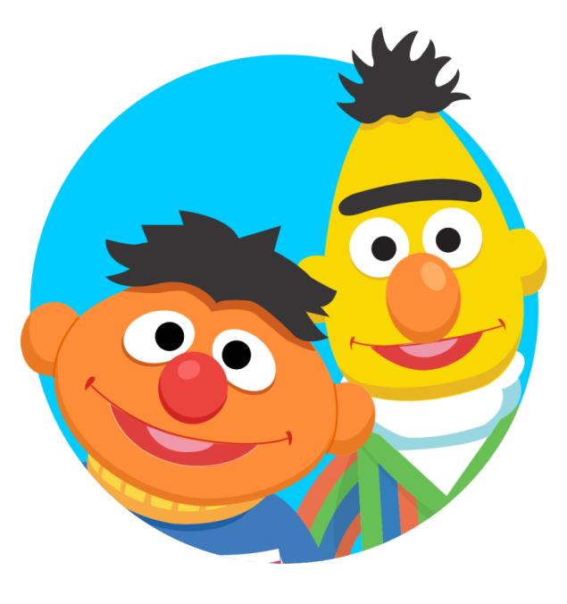

  [](https://github.com/Susam-Sokagi/Muze-Asistani)
  [](https://www.acikhack.com)
  [](https://www.teknofest.org)
  [](https://www.turkiyeacikkaynakplatformu.com/)
  


  
  <hr>

  
  
  
  
  
  
  

<hr>

  
  
  
  
  
  

<br />
<p align="center">
  <a href="https://github.com/Susam-Sokagi/Muze-Asistani">
    
  </a>
  <h2 align="center">Müze Asistanı</h2>
  <p align="center">
    Açık Hack '20
    <br />
    <br />
    <a href="https://www.youtube.com/watch?v=bLJLkUn2jcA&feature=youtu.be">Demo</a>
    ·
    <a href="https://github.com/Susam-Sokagi/Muze-Asistani/blob/master/sunum.pdf">Sunum</a>
    ·
    <a href="https://huggingface.co/savasy/bert-base-turkish-squad">Model</a>
    </a>
  </p>
    </p>
    <p align="center">
    <a href="#kullanım">Kullanım</a>
    ·
    <a href="#qr-kod">QR Kod</a>
  </p>
  <p align="center">
      <a href="https://github.com/Susam-Sokagi/Muze-Asistani/issues">Hata Bildir</a>
</p>


# İçindekiler

* [Proje Hakkında](#proje-hakkında)
* [BERT](#bert)
  * [Neden BERT ?](#neden-bert)
  * [BERT ile Soru-Cevap](#bert-ile-soru-cevap)
* [Takım](#takım)
* [Başlangıç](#başlangıç)
  * [Ön Şartlar](#ön-şartlar)
  * [Kurulum](#kurulum)
    * [Web Uygulaması](#web-uygulaması)
    * [Telegram Botu](#telegram-botu)
* [Kullanım](#kullanım)
  * [QR Kod](#qr-kod)
* [Yol Haritası](#yol-haritası)
* [Referanslar](#referanslar)
* [Lisans](#lisans)
* [İletişim](#iletişim)
* [Teşekkür](#teşekkür)

# Proje Hakkında

### Problem

Müzelerde ziyaretçilerin eserler ve tarihi olaylar hakkında bilgi edinmede sıkıntı çekmesi, bilgi edinmek için kişi veya kaynak bulmakta zorlanılması. Bu yüzden müze memnuniyetinin düşmesine ve kötü görüşler oluşmasına sebep olur.

### Proje Fikri
Müze ziyaretçileri ile interaktif iletişime geçen ve müze hakkında bilgi sağlayan bir bireysel asistan geliştirmeyi hedefliyoruz.


## BERT

2018 yılında, Google Bidirectional Encoder Representations from Transformers, kısaca BERT olarak bahsedilen modelini duyurdu. Adından da anlaşıldığı üzere cümleyi hem soldan sağa hem de sağdan sola olarak değerlendiriyor. Bu özelliği ile diğer modellere kıyasla, anlamı ve kelimelerin birbiriyle olan ilişkileri daha iyi çıkarmayı planlıyor ve bunu başarıyor. 

BERT, çift-yönlü olması dışında Masked Language Modeling (MLM) ve Next Sentence Prediction (NSP) adı verilen iki teknikle eğitiliyor. İlk teknikte, cümle içerisindeki kelimeler arasındaki ilişki üzerinde durulurken, ikinci teknik olan NSP’de ise cümleler arasındaki ilişki kurulur. Training esnasında ikili olarak gelen cümle çiftinde, ikinci cümlenin ilk cümlenin devamı olup olmadığı tahmin edilir. Bu teknikten önce ikinci cümlelerin %50'si rastgele değiştirilir, %50'si ise aynı şekilde bırakılır. Training esnasındaki optimizasyon, bu iki tekniğin kullanılırken ortaya çıkan kaybın minimuma indirilmesidir.

BERT 800M kelime hazinesine sahip olan BookCorpus ve 2.5B kelime hazinesine sahip olan Wikipedia veriseti kullanılarak bert_large ve bert_base adı verilen 2 temel modele sahiptir. BERT kendi başına GLM adı verilen, birden fazla problemde kullanılabilecek şekilde tasarlanmış bir model. 

### Neden BERT ?

* Çift yönlü kodlayıcı, BERT’i OpenAI GPT’den ve ELMo’dan ayırır.
* 24 Transformer bloğu, 1024 gizli katmanı ve 340M parametresi ile oldukça büyük bir modeldir.
* BooksCorpus (800 milyon kelime) ve İngilizce Wikipedia (2.5 milyar kelime) dahil, toplam 3.3 milyar kelimelik bir korpus üzerinden 40 epoch ile önceden eğitilmiştir.
* Herhangi bir kelimenin sağındaki ve solundaki kelimelerle olan ilişkisini çok iyi kavrıyor ve MLM ve NSP sayesinde içeriği iyi bir şekilde öğreniyor.
* Türkçe dil desteğine sahip, önceden eğitilmiş bir modeldir.

Tüm bu sebeplerden kaynaklı olarak biz Google tarafından geliştirilen BERT modelini kullanıyoruz.

### BERT ile Soru-Cevap

Bu projenin merkezi soru-cevap işlemine dayanmaktadır. Modelimizin çalışmasını inceleyecek olursak.

```sh
soru = "Tablonun boyutu"

acıklama_metni = '''Mona Lisa tablosunda resmedilmiş kişinin gerçek ismi Lisa Gherardini.
 Mona Lisa, “benim kadınım Lisa” anlamına geliyor. 
 Orijinal tablonun boyutları 77×53 cm. '''
```
Açıklama metinimiz ve sorumuzu tanımladık. Önceden eğitilmiş modelimiz sayesinde sorunun cevabını bulmaya çalışacağız. Bunun için model ve tokenizer işlemlerini yapmamız gerekmektedir.

```sh
output_dir = 'model'
model = BertForQuestionAnswering.from_pretrained(output_dir)
tokenizer = BertTokenizer.from_pretrained(output_dir)
```
Tanımlama işleminin ardından oluşturduğumuz fonksiyon aracılığı ile sorunun cevabını bulmaya çalışacağız.

```sh
answer, score = answer_question(soru, acıklama_metni)
```
Modelin bize verdiği cevap "77×53 cm ."

Modelin cevabı nasıl bulduğundan bahsetmek gerekirse,


Verilen metinin içerisinden, her bir token'ın cevab cümlesini için başlangıç ve bitiş belirlemesi gerekmektedir. Soru ile metin uyumlu ise cevap dönecektir. Değil ise dönmeyecektir. Soru ve metin uyumlu olsa bile kelimelerin arasındaki ilişki cevap olma olasılını değiştirecektir.


# Takım


| <a href="https://canturan10.github.io" target="_blank">**Oğuzcan Turan**</a> | <a href="https://github.com/akkayameva" target="_blank">**Meva Akkaya**</a> | <a href="https://github.com/burakakkas" target="_blank">**Y. Burak Akkaş**</a> |
| :---: |:---:| :---:|
| [](https://github.com/Susam-Sokagi/Muze-Asistani)    | [](https://github.com/Susam-Sokagi/Muze-Asistani) | [](https://github.com/Susam-Sokagi/Muze-Asistani)  |
| Derin Öğrenme Geliştirici | Derin Öğrenme Geliştirici | Full Stack Geliştirici |
| <a href="https://github.com/canturan10" target="_blank">`github.com/canturan10`</a> | <a href="https://github.com/akkayameva" target="_blank">`github.com/akkayameva`</a> | <a href="https://github.com/burakakkas" target="_blank">`github.com/burakakkas`</a> |
| <a href="https://www.linkedin.com/in/canturan10/" target="_blank">`linkedin.com/canturan10`</a> | <a href="https://www.linkedin.com/in/akkayameva/" target="_blank">`linkedin.com/akkayameva`</a> | <a href="https://www.linkedin.com/in/burakakkas/" target="_blank">`linkedin.com/burakakkas`</a> |
| <a href="mailto:can.turan.10@gmail.com" target="_blank">`can.turan.10@gmail.com`</a> | <a href="mailto:akkayameva@gmail.com" target="_blank">`akkayameva@gmail.com`</a> | <a href="mailto:burakakkas55@gmail.com" target="_blank">`burakakkas55@gmail.com`</a> |

# Başlangıç

## Ön Şartlar

  
  
  
  
  
  


Bu, yazılımı kullanmak için gerekli olan kütüphaneleri yüklemelisiniz.


```sh
pip install -r requirements.txt
```
Veya

```sh
pip install Flask
```
```sh
pip install Flask-SQLAlchemy
```
```sh
pip install opencv-python
```
```sh
pip install transformers
```
```sh
pip install python-telegram-bot
```
```sh
pip install torch
```
```sh
pip install pyzbar
```

## Kurulum

### Web Uygulaması

Kullanılan Veri Tabanı ve Model'in doğru şekilde tanımlanması gerekmektedir.
[app.py](https://github.com/Susam-Sokagi/Muze-Asistani/blob/master/app.py) dosyası içerisinde veritabanı ve model aşağıdaki gibi tanımlanır.

```sh
################ Tanımlama ################

logging.getLogger().setLevel(logging.INFO)

app = Flask(__name__)
app.config['SQLALCHEMY_DATABASE_URI'] = 'sqlite:///database.db'
app.config['SQLALCHEMY_TRACK_MODIFICATIONS'] = False
db = SQLAlchemy(app)

output_dir = 'model'
model = BertForQuestionAnswering.from_pretrained(output_dir)
tokenizer = BertTokenizer.from_pretrained(output_dir)
```
Web uygulamasının çalışması için '5000' portunun açık olması gerekmektedir. Eğer port müsait değilse,
```sh
if __name__ == '__main__':
    app.run(debug='true')
```
web uygulamamızı çalıstırmak için ihtiyaç duyduğumuz bu kod satırı açık olan portunuz ile aşağıdaki gibi güncellenebilir.
```sh
if __name__ == '__main__':
    app.run(debug='true', port=5050)
```
Sonrasında web uygulamamız çalışacaktır.
```sh
 * Serving Flask app "app.py"
 * Environment: development
 * Debug mode: off
 * Running on http://127.0.0.1:5000/ (Press CTRL+C to quit)
```


### Telegram Botu

Kullanılan Model ve Telegram Bot Token'ının doğru şekilde tanımlanması gerekmektedir. [bot.py](https://core.telegram.org/bots) dosyası içerisinde token ve model aşağıdaki gibi tanımlanır.
```sh
################ Tanımlama ################

logging.getLogger().setLevel(logging.INFO)
PHOTO, QUESTION = range(2)

TOKEN = "token"
updater = Updater(TOKEN, use_context=True)

output_dir = 'model'
model = BertForQuestionAnswering.from_pretrained(output_dir)
tokenizer = BertTokenizer.from_pretrained(output_dir)
```
Veri tabanı bağlantımızı sağlamak için aşağıdaki şekilde bağlantıyı sağlamalıyız.
```sh
################ DB Baglantısı ###############

connection = sqlite3.connect('database.db', check_same_thread=False)
cursor = connection.cursor()
```
Telegram botu oluşturma ve token elde etmek için [buradan](https://core.telegram.org/bots) ilgili sayfaya ulaşabilirsiniz.

Sonrasından Telegram Botumuz çalışacaktır.


# Kullanım
## Tanıtım Videosu

Videoyu izlemek için gif'e tıklayabirsin. Yada [buradan](https://www.youtube.com/watch?v=bLJLkUn2jcA&feature=youtu.be) ulaşabilirsin.

[](https://www.youtube.com/watch?v=bLJLkUn2jcA&feature=youtu.be)

[](https://www.youtube.com/watch?v=bLJLkUn2jcA&feature=youtu.be)

[](https://www.youtube.com/watch?v=bLJLkUn2jcA&feature=youtu.be)


## QR Kod

Objelere ait QR kodlardan seçtiklerimiz aşağıdadır. Diğerlere [buradan](https://github.com/Susam-Sokagi/Muze-Asistani/tree/master/QR) erişebilirsiniz.

<p>
Mona Lisa Tablosu
<br> </p>
<p>
Çingene Kızı Mozaiği
<br> </p>
</p>
<p>
Torquetum
<br> </p>
<p>
Kaşıkçı Elması
<br> </p>
</p>
</td>

# Lisans


Bu proje [MIT](https://github.com/Susam-Sokagi/Muze-Asistani/blob/master/LICENSE) lisanslıdır.

# Referanslar

Projenin geliştirilmesinde kullanılan kaynaklar aşağıdaki gibidir.

* BERT: https://github.com/google-research/bert
* BERT-base (Turkish): https://huggingface.co/dbmdz/bert-base-turkish-uncased
* BERT-QA (Turkish): https://huggingface.co/savasy/bert-base-turkish-squad
* TQuAD dataset:  https://github.com/TQuad/turkish-nlp-qa-dataset


# İletişim

Proje veya model ile ilgili sorun yaşarsanız [bizlere](#takım) ulaşabilirsiniz.

# Teşekkür

Projemizin gelişiminde bizlere yardımcı olan sevgili mentörlerimize teşekkürü borç biliriz.

* [Emrah Budur](https://tr.linkedin.com/in/emrahbudur)
* [Dr. Ömer Güneş](https://www.linkedin.com/in/farukhan)
* [Şükrü Bezen](https://tr.linkedin.com/in/sukrubezen)


Copyright © 2020 [Susam Sokağı](https://github.com/Susam-Sokagi).<br />
